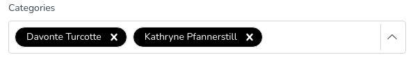
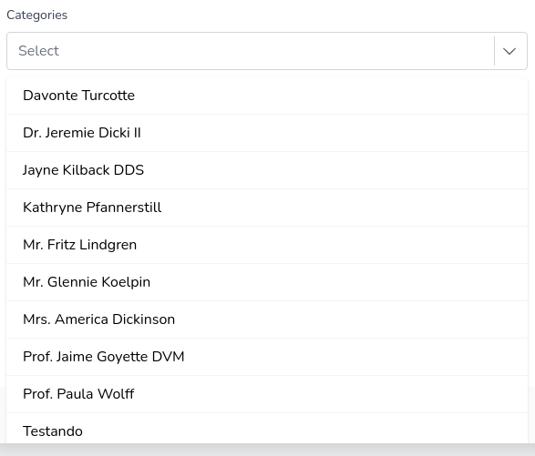

# Custom Select Component

&nbsp;&nbsp;&nbsp;&nbsp;&nbsp;&nbsp;
<br/>

## About
The need to create the component came from a study project which i was using this technologies/languages, so i needed a select that would be integrated with **Livewire** and could be reused anywhere, as many times as needed.

## Preview



## How to use
I tried to leave the project in the same structure in which it was used for easy understanding, follow the steps:
```
1. Download files
2. Paste the files into your project using the same folder structure
3. Don't forget to replace/remove the variables inside the files (app/Views/Components/Select.php) and (views/select/*)
4. Done
```

## Feedback
- Feel free to use, implement and share this component if you wish.
- Any suggestions, enhancement or bug, please create an issue.
